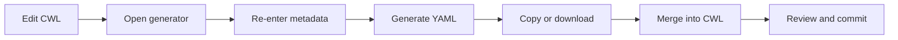
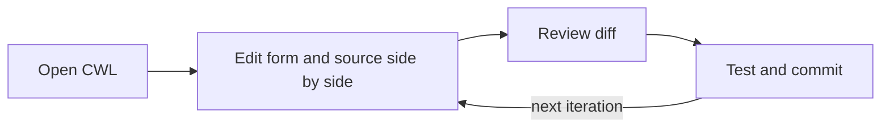

# A shorter metadata lifecycle

Metadata is part of a workflow's source, but a standalone generator makes it feel like a separate artifact. The VS Code extension closes that distance.

## The transfer step in the browser workflow

The online generator provides a rich form and renders either a metadata snippet or a minimal CWL document. The developer then transfers that output into the working file. Later changes require another round trip or careful hand-editing.

The boundary is small, but it has recurring costs: duplicated context, stale generator state, merge mistakes, and a diff that is visible only after the generated result is inserted.

## The inline feedback loop

The extension makes the active CWL document the single source of truth. The form is a structured view of the metadata already in that document, not a separate draft.

This is an evolution of the generator rather than a different metadata model:

- controlled fields remain easier and safer than hand-authoring nested YAML;
- the current file provides the initial state;
- each form change becomes an ordinary editor change;
- undo, save, review, and version control remain in the developer's normal environment;
- metadata evolves in the same commit as the software behavior it describes.

## What “better” means here

The inline editor is better for the iterative development lifecycle because it minimizes handoffs. It does not make the online generator obsolete for every situation: a browser tool can still be convenient for exploration or generating a standalone snippet when VS Code is unavailable.

For developers maintaining a real CWL repository, however, direct document binding reduces the number of representations and operations that can drift apart. The source file—not a browser session or downloaded copy—remains authoritative throughout authoring, review, conversion, and publication.
