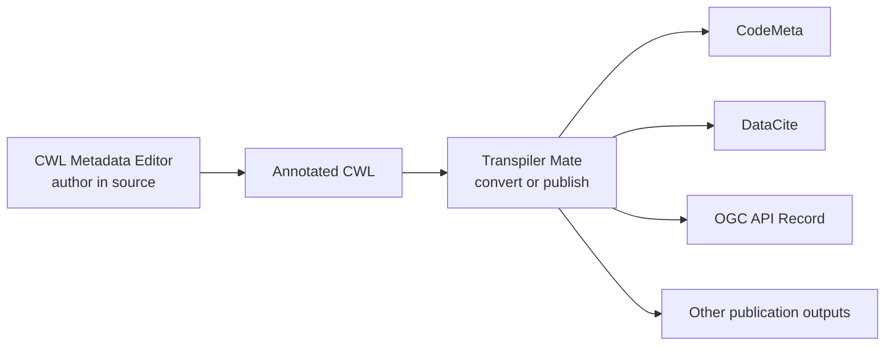

# Relationship to Transpiler Mate

The CWL Metadata Editor derives its metadata form from the [Transpiler Mate metadata generator](https://terradue.github.io/transpiler-mate/how-to-guides/metadata-generator.html). It preserves that generator's Schema.org authoring model while adapting the interaction to a document-bound VS Code panel.

## Parity and adaptation

“1:1 functionality” applies to the metadata the form can author: software details, SPDX licenses, help links, organizations, people, CRediT roles, operating systems, and keyword vocabularies map to the same Schema.org structures.

It does not mean every standalone browser control is copied literally:

| Generator responsibility | Extension adaptation |
| --- | --- |
| Start with an empty form or example | Read the active CWL metadata |
| Render generated YAML | Update the actual document |
| Switch between snippet and minimal CWL | Keep the complete existing CWL document |
| Copy or download output | Use normal editor save and source control |
| Show a separate validation summary | Use field constraints and project validation in the development loop |
| Use a standalone theme | Follow the active VS Code theme |

This boundary is intentional. Reintroducing copy and download controls would preserve the transfer step that the extension is designed to remove.

## Complementary responsibilities

The two projects occupy consecutive parts of the metadata lifecycle:

Use the extension for frequent, human-centered metadata maintenance during development. Use Transpiler Mate for machine-oriented transformations, packaging, and publication workflows after the annotated CWL is ready.

## Compatibility boundary

The extension recognizes a defined set of [top-level metadata keys](../reference/metadata-fields.md). Transpiler Mate can evolve independently and may support properties or downstream operations that the extension does not expose. Unsupported CWL entries are preserved in the source, but they are not editable through the form.

When adopting a newer Transpiler Mate convention, check the extension's field reference before assuming that a newly introduced property has a corresponding control.
