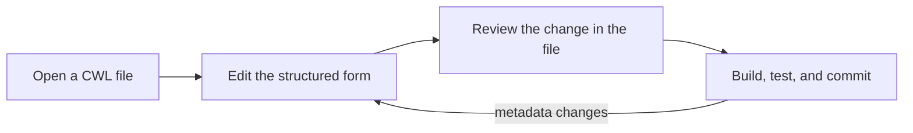

# CWL Metadata Editor

Edit Schema.org `SoftwareApplication` metadata in the same place where you develop a Common Workflow Language (CWL) tool or workflow.

The CWL Metadata Editor brings the metadata-authoring capabilities of the [Transpiler Mate metadata generator](https://terradue.github.io/transpiler-mate/how-to-guides/metadata-generator.html) into VS Code. The form opens beside the active `.cwl` file, loads its current metadata, and writes changes back as you type.

## Why edit metadata inline?

The online generator is useful for creating a metadata block, but using its result is a separate operation: generate YAML, copy or download it, insert it into a CWL document, and repeat that exchange whenever metadata changes.

The extension turns that exchange into one feedback loop:

You retain the same structured fields and curated choices while gaining:

- pre-filled values from the active CWL document;
- updates directly in the source file after each change;
- ordinary VS Code diff, undo, save, and source-control workflows;
- preservation of CWL logic, comments, ordering, and formatting outside the supported top-level metadata keys;
- no copy-and-paste boundary between metadata authoring and workflow development.

!!! note "Author here, publish with Transpiler Mate"
    The extension authors Schema.org metadata. [Transpiler Mate](https://terradue.github.io/transpiler-mate/) remains the downstream tool for converting annotated CWL into CodeMeta, DataCite, OGC API Records, and other publication formats.

## Choose what you need

- New to the extension? Complete [Edit metadata for your first CWL tool](tutorials/first-edit.md).
- Have an annotated workflow already? Follow [Edit existing metadata](how-to-guides/edit-existing-metadata.md).
- Used the web generator before? See [Move from the online generator](how-to-guides/migrate-from-generator.md).
- Need exact field or serialization details? Open the [reference](reference/index.md).
- Want the design rationale? Read [A shorter metadata lifecycle](explanation/inline-lifecycle.md).
